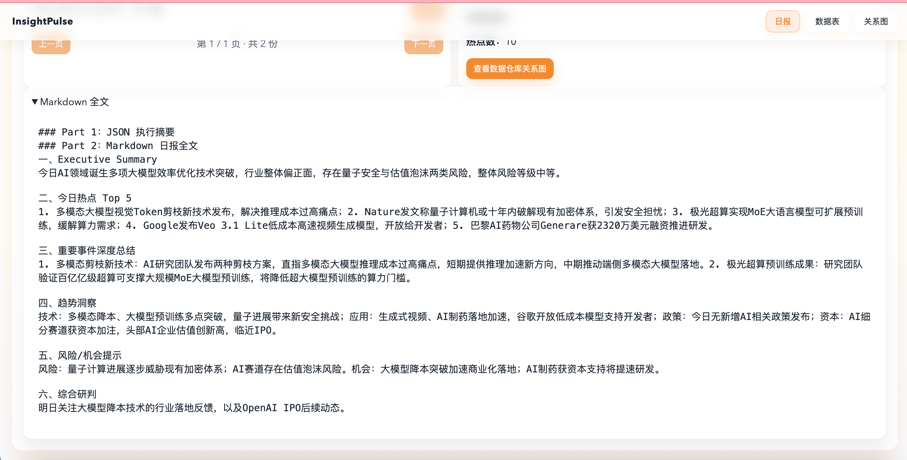
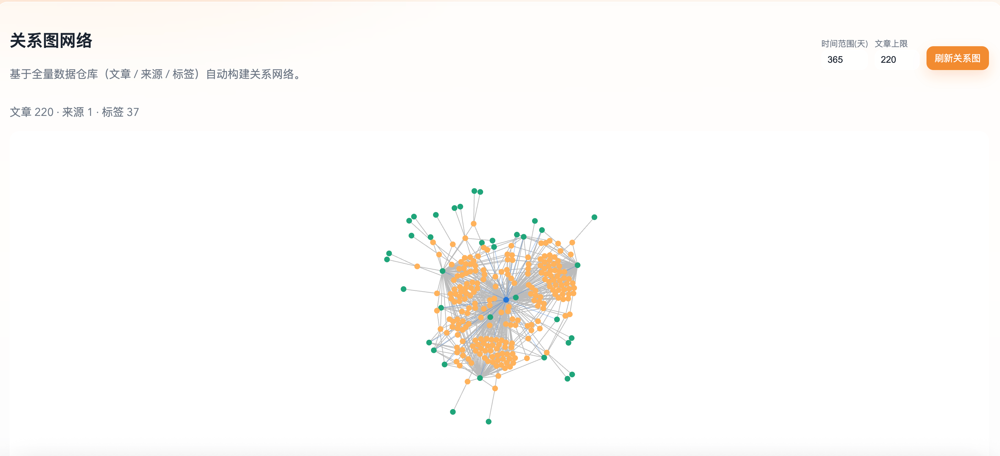

# InsightPulse

InsightPulse 是一个面向 AI 行业信息情报的端到端系统，包含：
- 多源 RSS 抓取与结构化提取
- 信号工程热度评分（平台特定公式 + 平台权重）
- 语义聚类 / 多样性采样 / 新兴主题检测
- 串行多智能体日报生成（HotTopics → DeepSummary → Trend → Opportunity）
- 数据仓库关系网可视化（文章 / 来源 / 标签）

---

## 1. 整体架构

### 系统分层
1. 数据采集层：`backend/services/rss_crawler.py`
2. 数据与索引层：SQLite + FTS5（`backend/core/database.py`）
3. 信号工程层：`backend/services/scoring_engine.py`
4. 聚类层：`backend/services/clustering_engine.py`
5. 智能体层：`backend/agents/*`
6. API 层：FastAPI（`backend/api/v1/*`）
7. 前端展示层：Vue（`frontend/*`）

### 高层流程
1. 定时/手动抓取 RSS
2. 入库文章主表 + 分源结构化表
3. 计算信号并写入 `articles_signals`
4. 语义聚类与多样性采样
5. 串行调用四个 Agent 生成日报
6. 结果入库 `daily_reports`
7. 前端展示日报、数据表和仓库关系网

---

## 2. 数据源与结构化提取 Schema

### 2.1 主表（统一文章）
`articles`
- 主键与路由：`id`, `external_id`, `url`, `source`, `source_type`, `feed_id`
- 内容：`title`, `summary`, `content`, `content_hash`
- 元信息：`author`, `published_at`, `language`, `tags`
- 内容特征：`reading_time_minutes`, `image_url`, `has_code`, `has_dataset`

### 2.2 数据源专属结构化表

1. `arxiv_metadata`（学术源）
- `arxiv_id`, `categories`, `primary_category`, `authors`
- `citation_count`, `reference_count`, `author_hindex_avg`
- `is_novelty`, `is_sota`, `impact_score`

2. `hn_metadata`（社区源）
- `hn_id`, `hn_score`, `hn_comments`, `hn_rank`
- `hn_author`, `hn_author_karma`
- `velocity_score`, `score_peak`, `score_peak_at`

3. `media_metadata`（媒体源）
- `publisher`, `section`, `article_type`
- `mentioned_companies/persons/products/models`
- `is_funding_news`, `funding_amount`, `is_regulation_news`
- `sentiment_label`, `sentiment_confidence`, `has_controversy`

4. `official_metadata`（官方源）
- `announcement_type`, `product_name`, `release_version`
- `is_partnership`, `partner_name`, `is_pricing_update`
- `model_name`, `benchmark_results`, `is_major_announcement`

### 2.3 信号与图谱相关表
1. `articles_signals`：热度分项与综合分（按 `article_id + date`）
2. `articles_entities`：实体抽取与趋势属性
3. `article_relations`：关系三元组（subject / relation / object）
4. `source_authorities`：来源权威基线与分层

---

## 3. 热度信号体系（日报前置）

### 3.1 信号维度
1. Authority：来源权威性
2. Academic：学术性（含引用）
3. Community：社区互动共鸣
4. Recency：时效衰减
5. Quality：内容质量
6. Novelty：语义新颖性
7. Platform Signal：平台特定热度（新增）

### 3.2 平台特定热度公式
在 `ScoringEngine` 中按平台分别计算：
- arXiv / academic：引用强度（`log1p(citation)`）+ 学术质量 + 时效
- 社区源（HN/聚合）：互动分 + 排名/速度
- 官方源：权威 + 时效 + 内容质量
- 媒体源：权威 + 质量 + 时效

然后乘以平台权重聚合为全局热度。

### 3.3 综合分
`composite_score` 由多维信号与平台信号共同构成，并写回 `articles_signals`。

---

## 4. 日报 Agent 流程（串行）

### 4.1 编排
`backend/agents/orchestrator/agent.py`

执行顺序：
1. `build_context`：读取最近 N 天文章
2. `scoring_prepass`：
   - `ScoringEngine.score_articles`
   - 写入 `articles_signals`
   - `SemanticClusteringEngine.cluster_articles`
   - 新兴簇检测 `detect_emerging_clusters`
3. HotTopics Agent（热点）
4. DeepSummary Agent（重要事件深度总结）
5. Trend Agent（技术/应用/政策/资本趋势）
6. OpportunityScanner Agent（风险/机会）
7. ReportComposer（JSON + Markdown）

### 4.2 Agent 间锚定关系
- HotTopics 输出 `hot_topics` + `hot_topic_articles`
- DeepSummary 事件自动对齐 `anchor_hot_topics`
- Trend 读取热点/事件锚定做维度分析
- Opportunity 读取热点+事件+趋势给出风险/机会信号

### 4.3 性能模式开关
- `POST /api/v1/reports/generate` 支持 `fast_mode=true`
- 会缩减各 Agent 输入规模并优先快速 JSON 输出
- 前端日报页可直接切换“性能模式”

---

## 5. 聚类、过滤、去重

### 5.1 去重
1. URL 唯一约束（`articles.url`）
2. `content_hash`（内容哈希去重）
3. 热点与事件处理阶段的 URL 去重

### 5.2 语义聚类与采样
`backend/services/clustering_engine.py`
- 使用 SentenceTransformer 生成向量
- KMeans 聚类
- 每簇按分采样（防止单一热点淹没）
- 检测新兴簇（规模/均分增速）

### 5.3 过滤策略
- HotTopics：Top 文章 + 来源多样性约束
- DeepSummary：热点引导过滤 + 高分补充
- Trend：热点/事件锚定优先，再按维度补齐

---

## 6. 关系网生成（全仓库）

### 6.1 后端接口
`GET /api/v1/signals/network`

输入参数：
- `days`：构图时间范围
- `max_articles`：参与构图文章上限

输出：
- `nodes`：`article` / `source` / `tag`
- `links`：
  - `published_by`（article → source）
  - `tagged_with`（article → tag）
  - `source_tag_affinity`（source → tag，聚合边）
- `meta`：文章数、来源数、标签数

### 6.2 前端展示
关系图页已改为“数据仓库图”，不依赖当前日报对象。

---

## 7. API 概览（核心）

### Feeds / Articles
- `POST /api/v1/feeds/seed-default`
- `POST /api/v1/feeds/crawl-all`
- `GET /api/v1/articles/`
- `GET /api/v1/articles/{article_id}`

### Signals
- `POST /api/v1/signals/compute`（可单独重算热度）
- `GET /api/v1/signals/stats`
- `GET /api/v1/signals/top`
- `GET /api/v1/signals/network`

### Reports
- `POST /api/v1/reports/generate?days=7&language=mixed&fast_mode=true|false`
- `GET /api/v1/reports/`（历史分页）
- `GET /api/v1/reports/by-id/{report_id}`
- `GET /api/v1/reports/{date}`（该日期最新一份）

---

## 8. 本地运行

### 一键快速启动（推荐）
```bash
cd /Users/ren/Documents/GitHub/InsightPulse
./scripts/dev_up.sh
```

一键停止：
```bash
cd /Users/ren/Documents/GitHub/InsightPulse
./scripts/dev_down.sh
```

可选：关闭后端热重载（更稳）：
```bash
BACKEND_RELOAD=0 ./scripts/dev_up.sh
```

### 后端
```bash
cd backend
source .venv/bin/activate
pip install -r requirements.txt
uvicorn main:app --host 0.0.0.0 --port 8000 --reload
```

### 前端（静态）
```bash
cd frontend
python -m http.server 4173
```
打开 `http://127.0.0.1:4173`

或者直接点击html文件打开

---

## 9. 当前实现说明

1. 日报支持同一天多次生成并保留历史记录（按 `report_id` 区分）。
2. 数据表支持独立“重新计算热度”，不依赖生成日报。
3. 关系图默认来自全仓库数据，不再仅用日报结果。
4. 旧库结构会在关键路径做兼容迁移（如 `daily_reports` 字段补齐）。

---

## 10. Schema 设计思路（按数据源特性建模）

本项目的 schema 不是“统一字段硬套”，而是“统一主表 + 分源扩展表”：

1. 统一主表 `articles` 负责跨源通用检索与展示（标题、摘要、发布时间、URL、来源）。
2. 分源表承接各平台“特有信号”：
   - arXiv 重点是引用、类别、学术影响；
   - HN 重点是分数、评论、增长速度；
   - 媒体源重点是实体、融资/政策/争议类型；
   - 官方源重点是版本、公告类型、合作与定价更新。
3. 信号层与业务层解耦：`articles_signals` 独立存储分项分数与综合分，支持重复重算与 A/B 调参。
4. 图谱层解耦：实体和关系（`articles_entities` / `article_relations`）独立维护，避免污染主数据表。

一句话：先“保真采集”每个源的原生结构，再在上层做统一评分与统一分析。

---

## 11. AI 在流程中的使用位置

### 11.1 数据处理链路
1. 数据清洗：摘要裁剪、语言归一、去重（URL/hash）。
2. 信息抽取：实体、关系、事件候选、主题词。
3. 分类：热点归类、事件归类、趋势维度归类（技术/应用/政策/资本）。
4. 分析推理：DeepSummary/Trend/Opportunity 等 Agent 进行解释与判断。
5. 报告生成：ReportComposer 汇总 JSON + Markdown。
6. 可视化：前端关系图将文章-来源-标签关系可视化（仓库级别）。

### 11.2 工程开发中 AI 的使用
1. 先让 AI 对同类开源项目做技术拆解（架构、数据流、模块边界）。
2. 人工快速阅读并筛选可迁移模式。
3. 在新项目中由 AI 辅助复现（先骨架，再细化）。
4. 对 AI 生成代码做“可运行验证 + 日志回放 + 数据抽查”。

---

## 12. Prompt 设计与开发记录（可复用方法）

采用“三段式 Prompt”：

1. 任务定义：明确输入、输出 schema、边界条件（必须 JSON / 字段必须存在）。
2. 证据约束：要求每个结论可追溯到文章片段或来源列表，禁止无依据发挥。
3. 失败策略：当信息不足时返回 `unknown` 或空数组，不允许臆造。

实践原则：
- 小模型先做结构化抽取，大模型做解释与综合；
- 先出机器可解析 JSON，再做 Markdown 文案；
- Prompt 版本化（按 Agent 保存），每次只改一两个变量，便于回归比较。

prompt在cursor 和 codex 中，暂时没有提取出来。
---

## 13. AI 输出有误时的处理机制

### 13.1 错误检测
1. Schema 校验：字段缺失/类型错误直接判失败。
2. 业务校验：如链接为空、分数越界、事件与来源不匹配。
3. 运行校验：接口异常、SQL 异常、模型不可用、依赖缺失。

### 13.2 重试策略
1. 首次失败：同 Prompt 重试（短退避）。
2. 二次失败：降级（减少上下文、切换简化模式 fast_mode）。
3. 三次失败：回退到规则/统计结果（保证系统可用）。

### 13.3 人工介入边界
以下场景应人工介入：
1. 高频失败（同类错误持续出现）。
2. 关键字段长期为空或明显失真。
3. 涉及高风险结论（政策、投融资判断）且证据不足。

---

## 14. 关键决策（AI 使用方式）

1. 决策一：先信号工程再 Agent 推理  
   - 先做可解释评分与过滤，减少 LLM token 消耗并提升稳定性。
2. 决策二：串行多 Agent 而非一次性大 Prompt  
   - 每个 Agent 职责单一，便于定位错误与独立优化。
3. 决策三：保留“性能模式”  
   - 在时延与质量间可切换，满足开发调试与线上稳定双需求。
4. 决策四：结果可追溯  
   - 报告中事件尽量绑定文章 URL/来源，降低“黑盒结论”风险。

日报


关系图网络 待完善


## 需改进点
1. 日报生成的速度
2. 接入知识图谱，构建完善关系网络，强化大模型识别知识片段之间的结构联系，提高预测的准确度
3. 支持自己添加数据，结合目前的信息推测未来走向。
